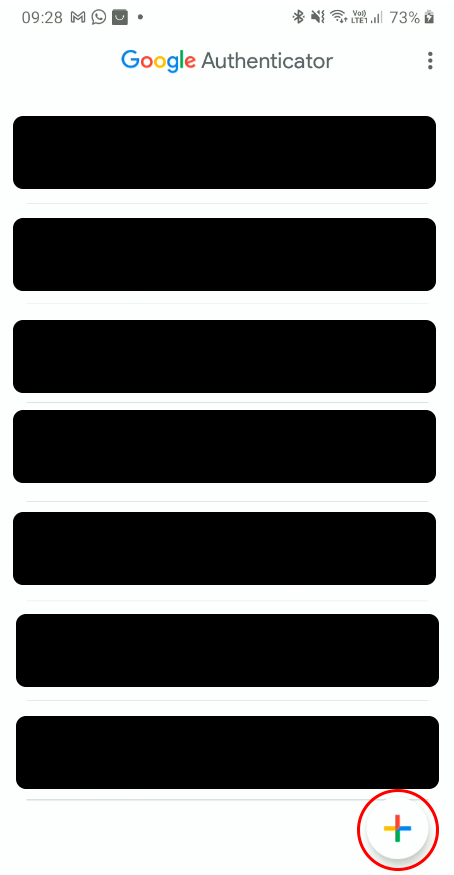
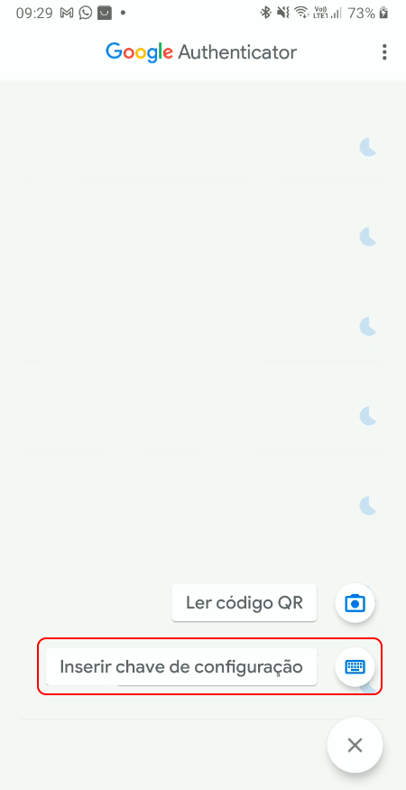
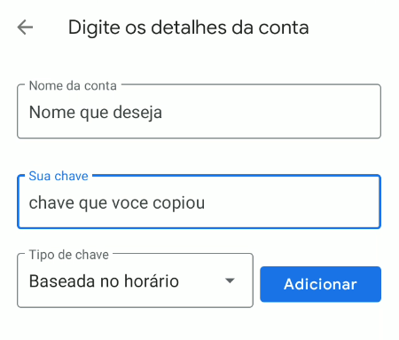
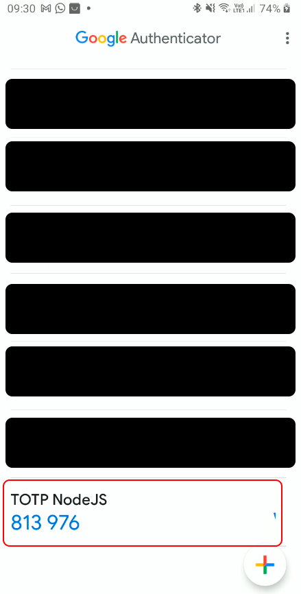

<div id="inicio"></div>
<h1 align="center"> 
	🚀  otp_typescript 🚀
</h1>

> Serviço de autenticação de 2 fatores para gerar uma chave de acesso única utilizando criptografia OTP. O projeto é totalmente desenvolvido em TypeScript e utiliza um banco de dados sqlite juntamente com o orm Prisma.

## 💻 Pré-requisitos

Antes de começar, verifique se você atendeu aos seguintes requisitos:

* Ter o NodeJS instalado no seu computador.
* Ter a extensão REST Client ou o Insomnia para consumir a API.

## 🚀 Configurando otp_typescript

Execute os seguintes comandos para gerar o DB sqlite para testar o projeto.

```
npm db:migrate
```

```
npm db:push
```

## ☕ Usando otp_typescript

Para iniciar o projeto execute o seguinte comando: `npm start`.

Existe um arquivo com as rotas para testar o serviço no `Insomnia`, o arquivo está na pasta raiz com o nome `rotas.json`. Mas você também pode testar as rotas usando o arquivo `rotas.http` e utilizando a extensão `REST Client`.

Para adicionar a conta cadastrada no app do Google Autenticator, execute a rota Generate OTP e copie o campo `base32` que foi retornado e cole no app. Como nas imagens abaixo.

 

 



<!-- Imagens aqui -->

Para validar o código você pode usar as rotas Validate OTP ou Verify OTP.

Você também pode desabilitar o OTP da conta criada.

Você pode acessar a interface do prisma usando o comando `npm db:studio` e acessand a URL `http://localhost:5555/`.

## 🤝 Colaborador

Agradecemos à seguinte pessoa que contribuiu para este projeto:

<table>
  <tr>
    <td align="center">
      <a href="https://www.linkedin.com/in/erick-vasconcelos-50baa8150/" target="_blank">
        <br>
        <sub>
          <b>Erick Vasconcelos</b>
        </sub><br>
        <a href="https://www.buymeacoffee.com/erickzaunlab" target="_blank"></a>
      </a>
    </td>
  </tr>
</table>


[⬆ Voltar ao topo](#inicio)<br>
